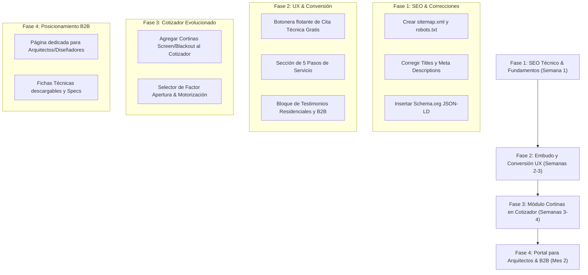

# 📊 Análisis Exhaustivo de Competencia Directa: Canet vs. Estilos y Detalles vs. Ventanales de Honduras

> **Fecha:** Octubre 2026  
> **Proyecto:** Ventanales de Honduras (`www.ventanaleshn.com`)  
> **Objetivo:** Analizar la arquitectura, catálogo, embudos de conversión, estrategias de UX/UI y posicionamiento técnico/SEO de **Canet** (`canetcam.com`) y **Estilos y Detalles** (`estilosydetalles.net`) para enriquecer y potenciar la plataforma de Ventanales de Honduras.

---

## 📌 1. Resumen Ejecutivo y Cuadro Comparativo

| Dimensión | 🏢 Ventanales de Honduras (`ventanaleshn.com`) | 🌿 Canet (`canetcam.com`) | 🎨 Estilos y Detalles (`estilosydetalles.net`) |
| :--- | :--- | :--- | :--- |
| **Especialidad Core** | Ventanería de Aluminio & PVC, Fachadas Comerciales, Vidriería Templada, Mamparas, Pasamanos + Cortinas/Persianas | Persianas, Cortinas de Interior, Toldos & Soluciones de Exterior, Motorización, Alfombras | Cortinas & Persianas Decorativas a Medida, Protección Solar Exterior, Domótica (Vertilux) |
| **Cobertura Geográfica** | Honduras (Tegucigalpa, SPS y cobertura nacional) | Centroamérica (Costa Rica, Honduras, Nicaragua, etc.). Showroom en SPS (Urban Plaza, Col. Trejo) | Honduras (Showroom físico en Tegucigalpa - Col. Palmira + servicio en SPS) |
| **Stack Tecnológico** | PHP 8.4 + Porto HTML + ContentBuilder.js + Bootstrap | WordPress + Yoast SEO + Revolution Slider + WooCommerce blocks + Image Map Pro | Wix / Web Builder Minimalista |
| **Herramientas Interactivas** | ⚡ **Cotizador Online Interactivo** (Cálculo de precio en tiempo real para ventanas, PVC/Aluminio, vidrios) | Formulario "Solicitá Tu Cita de Medición" + Hotspots interactivos en fotos de ambientes | Formulario básico de contacto + Múltiples botones de WhatsApp |
| **Fichas Técnicas & Especificaciones** | Detalle de perfiles, espesores de vidrio y acabados | Factores de apertura (1%, 3%, 5%, Blackout), % filtración UV, telas ignífugas, motores Somfy | Distribuidor oficial **Vertilux**, sistema domótico **VTi® Smart Hub**, catálogo de telas |
| **Prueba Social / Confianza** | Galería de proyectos terminados | Respaldo de marca regional, garantías por producto, certificaciones de telas | Testimonios de clientes residenciales y diseñadores de interiores ("Sala parece de revista") |
| **Infraestructura SEO** | ⚠️ *Requiere corrección:* Ausencia de `sitemap.xml`, `robots.txt` falso, títulos duplicados, sin JSON-LD | ✅ Yoast SEO, Schema Graph (JSON-LD), sitemap activo, canonicals y meta descripciones optimizadas | Indexación básica, metaetiquetas manuales en Wix |

---

## 🔍 2. Auditoría Detallada por Competidor

### A. Persianas Canet (`https://canetcam.com/`)

#### 1. Identidad y Posicionamiento
* **Propuesta de Valor:** Soluciones integrales de protección solar y decoración con respaldo multinacional centroamericano.
* **Tono de Comunicación:** Profesional, institucional y orientado a la elegancia funcional del hogar y la oficina.
* **Elemento Clave de Confianza:** Presencia en múltiples países, showrooms físicos (San Pedro Sula en Urban Plaza, Col. Trejo), certificación de telas y servicios postventa.

#### 2. Catálogo y Exposición de Productos
* **Cortinas y Persianas de Interior:** Arrollables, Neolux (Dual Shades), Celulares, Plisadas, Paneles Deslizantes, Cortinas de tela tradicionales (Ripplefold), Persianas de Madera y Aluminio.
* **Exterior y Toldos:** Toldos retráctiles de brazo invisible, sistema **Zipro** (guiado lateral con cierre hermético contra el viento), cortinas enrollables para terrazas.
* **Enfoque Técnico en Fichas:** Explicación detallada de los **factores de apertura** (1%, 3%, 5% y 100% Blackout), resistencia a rayos UV (hasta 99%), ahorro energético y materiales retardantes al fuego.
* **Motorización:** Motores Somfy / Tuya compatibles con Alexa, Google Assistant y mandos a distancia.

#### 3. Experiencia de Usuario (UX/UI) e Interactividad
* **Image Map Pro (Hotspots Interactivos):** Fotografías de alta resolución de ambientes (salas, habitaciones, oficinas) con puntos interactivos para explorar el producto exacto instalado.
* **Embudo de Conversión:** Botón omnipresente: *"Solicitá tu cita de medición sin costo"*, con formulario directo de agendamiento y atención telefónica/WhatsApp local (+504 3192-2469).

---

### B. Estilos y Detalles (`https://www.estilosydetalles.net/`)

#### 1. Identidad y Posicionamiento
* **Propuesta de Valor:** Renovación de espacios con cortinas hechas a medida, atención ultra-personalizada y acabados de lujo sin comprometer el presupuesto.
* **Público Objetivo:** Propietarios residenciales, oficinas boutique, **arquitectos y diseñadores de interiores** en Tegucigalpa y SPS.
* **Elemento Clave de Confianza:** Showroom físico en Tegucigalpa (Colonia Palmira, Calle Balboa, Casa 2249) y representación exclusiva/oficial de la marca internacional **Vertilux**.

#### 2. Proceso de Servicio Transparente (Customer Journey)
Estilos y Detalles destaca su metodología en **5 pasos muy claros**, lo cual genera alta certeza en el comprador:
1. **Contacto e Inicio:** Solicitud vía WhatsApp, llamada o formulario.
2. **Selección de Estilo y Tejido:** Visita a domicilio con catálogos y muestras físicas en mano.
3. **Cotización y Aprobación:** Presupuesto detallado, aceptación y pago de anticipo.
4. **Fabricación a Medida:** Visita técnica de verificación de medidas y confección personalizada.
5. **Instalación Profesional:** Montaje por técnicos capacitados y entrega con garantía.

#### 3. Prueba Social y Domótica
* **Sección de Testimonios Reales:** Citas textuales de clientes residenciales y profesionales del diseño:
  > *"Mi sala parece de revista, no tenía idea de cuánto podían cambiar unas buenas cortinas un espacio."* — Laura Mendoza  
  > *"Trabajo con Estilos y Detalles para mis proyectos, siempre cumplen con tiempos."* — Marcela Mondragón (Diseñadora/Arquitecta)
* **Domótica Vertilux:** Integración del sistema **VTi® Smart Hub** para control desde smartphones y comandos de voz.

---

## 🚀 3. Mapa de Oportunidades y Recomendaciones para Ventanales de Honduras

Ventanales de Honduras posee una **ventaja competitiva estructural única**: fabricamos y distribuimos tanto **ventanería arquitectónica (aluminio y PVC), vidriería y mamparas** como **cortinas y persianas decorativas**. Ni Canet ni Estilos y Detalles ofrecen la solución arquitectónica exterior (ventanas, puertas correderas, fachadas comerciales).

### 🛠️ Eje 1: Evolución del Cotizador Online (Nuestra Superpotencia)
* **Situación:** `ventanaleshn.com` ya cuenta con un cotizador interactivo (`cotizar.html`) para ventanas y puertas.
* **Mejora Inspirada en Canet/Estilos y Detalles:**
  1. Agregar un módulo de **Cotizador de Cortinas y Persianas**:
     * Selección de Tipo: Enrollable Screen, Blackout, Neolux (Dual Shade), Panel Deslizante.
     * Selección de Factor de Apertura: 1% (mayor privacidad/UV), 3%, 5% (mayor visibilidad) o Blackout.
     * Opción de Motorización: Manual vs. Motor Inteligente (compatible con Alexa/Google).
     * Cálculo de precio estimado por metros cuadrados (\(m^2\)) e integración directa con envío a WhatsApp en 1 clic.

---

### 🎨 Eje 2: Experiencia de Visualización de Tejidos y Ambientes (Aprendido de Canet)
* **Hotspots Interactivos (Visualizador de Proyectos):**
  * Implementar en la galería de proyectos imágenes interactivas donde el cliente pueda hacer clic en una ventana/persiana y ver:
    * El tipo de perfil (PVC vs Aluminio).
    * El tejido usado (Screen 3% / Blackout).
    * El costo estimado y un botón para pedir ese mismo diseño.
* **Guía Visual de Factores de Apertura:**
  * Crear una comparación interactiva (slider Antes/Después o Día/Noche) para mostrar cómo se ve la luz a través de Screen 1%, 3%, 5% y Blackout.

---

### 🏡 Eje 3: Muestrario a Domicilio & Cita Técnica (Aprendido de Estilos y Detalles)
* **Lanzar la Promesa de Servicio:**  
  *"Visita Técnica + Maletín de Muestras a Domicilio en Tegucigalpa y SPS sin Costo ni Compromiso"*.
* **Landing/Modal de Conversión Rápida:**  
  Un formulario flotante simple de 3 campos: *Nombre, Teléfono/WhatsApp, Ciudad (Tegucigalpa / SPS) y Producto de Interés (Ventanas, Cortinas, Mamparas)*.
* **Explicar el Proceso en 5 Pasos:**  
  Publicar una sección visual idéntica al modelo de 5 pasos (Contacto ➔ Muestras ➔ Cotización ➔ Confección/Ensamblaje ➔ Instalación).

---

### 🏢 Eje 4: Sección Dedicada para Arquitectos, Constructores y Diseñadores (B2B)
* **Landing de Socios Comerciales:**  
  Crear `/arquitectos/` o una pestaña en el menú principal enfocada a profesionales.
* **Beneficios B2B:**
  * Descuentos por volumen para proyectos residenciales y edificios comerciales.
  * Archivos CAD/BIM y fichas técnicas descargables de nuestros perfiles de aluminio y PVC.
  * Asesoría técnica en ventilación, aislamiento acústico y protección térmica.
  * Testimonios de arquitectos locales certificados.

---

### 📈 Eje 5: Optimización SEO Técnico e IA Readiness (Superando a Ambos Competidores)
Para posicionar `ventanaleshn.com` en el #1 de Google Honduras para términos como *cortinas en honduras*, *persianas tegucigalpa*, *ventanas de aluminio san pedro sula*:

1. **Generación de `sitemap.xml` y `robots.txt` Reales:**
   * Reemplazar el `robots.txt` interceptado por un archivo plano con directivas para Googlebot y bots de IA (ChatGPT, Claude, Perplexity).
   * Crear el sitemap dinámico incluyendo todas las categorías de productos y proyectos.

2. **Corrección de Metadatos y Estructura On-Page:**
   * Eliminar el título duplicado `"Bienvenidos | Design Solutions By Ventanales"` y asignar títulos específicos por categoría (ej. *"Cortinas Enrollables y Blackout en Honduras | Ventanales HN"*).
   * Redactar meta descripciones únicas de 150-160 caracteres orientadas a la conversión.

3. **Marcado de Datos Estructurados (Schema.org / JSON-LD):**
   * Insertar esquemas JSON-LD de `LocalBusiness` (con geo-coordenadas de Tegucigalpa y SPS), `Product` (con especificaciones de perfiles y cortinas) y `FAQPage`.

---

## 📋 Backlog Priorizado de Acciones Inmediatas

---

## 🎯 Conclusión
Al combinar la **capacidad de cotización instantánea de Ventanales de Honduras** con la **sofisticación visual de Canet** y el **proceso de atención al cliente boutique con muestras a domicilio de Estilos y Detalles**, logramos una propuesta imbatible en el mercado hondureño.
