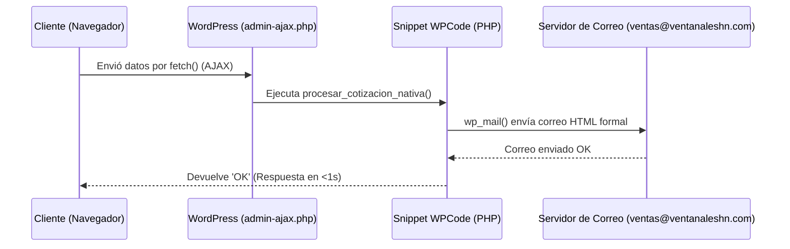

# 🛠️ Guía Técnica: Formulario de Cotización Sin Plugins (WPCode + PHP Nativo)

> **Proyecto:** Ventanales de Honduras (`ventanaleshn.com`)  
> **Objetivo:** Implementar formularios de captura y cotización ultrarrápidos (0ms de carga extra) sin depender de plugins de terceros (CF7, WPForms, Gravity Forms).

---

## 📌 ¿Por qué hacerlo sin plugins?
1. **Velocidad Extrema (PageSpeed 95+):** Los plugins tradicionales cargan scripts CSS y JS en todas las páginas de tu sitio web, ralentizando el rendimiento móvil.
2. **Seguridad y Estabilidad:** Los plugins de formularios son una de las principales puertas de vulnerabilidades y requieren actualizaciones continuas.
3. **Cero Licencias de Pago:** No requiere versiones "Pro" para enviar correos HTML personalizados o derivar a WhatsApp.

---

## 👨‍💻 Paso 1: Configuración del Snippet PHP en WPCode

1. En el panel de WordPress ve a **Code Snippets** (WPCode) > **Add Snippet**.
2. Selecciona **Add Your Custom Code (PHP)**.
3. Pega el siguiente snippet completo:

```php
<?php
// Register AJAX action handlers for both logged-in and guest users
add_action('wp_ajax_procesar_cotizacion_nativa', 'procesar_cotizacion_nativa');
add_action('wp_ajax_nopriv_procesar_cotizacion_nativa', 'procesar_cotizacion_nativa');

function procesar_cotizacion_nativa() {
    // Sanitize input fields
    $nombre    = isset($_POST['nombre']) ? sanitize_text_field($_POST['nombre']) : 'Sin nombre';
    $telefono  = isset($_POST['telefono']) ? sanitize_text_field($_POST['telefono']) : 'Sin teléfono';
    $email     = isset($_POST['email']) ? sanitize_email($_POST['email']) : 'Sin email';
    $ciudad    = isset($_POST['ciudad']) ? sanitize_text_field($_POST['ciudad']) : 'Tegucigalpa';
    $producto  = isset($_POST['producto']) ? sanitize_text_field($_POST['producto']) : 'General';
    $notas     = isset($_POST['notas']) ? sanitize_textarea_field($_POST['notas']) : 'Sin notas';

    $para = 'ventas@ventanaleshn.com';
    $asunto = '¡Nueva Cotización Web: ' . $nombre . ' (' . $ciudad . ')!';
    
    // Construct HTML Email Body
    $mensaje = "<html><body style='font-family: Arial, sans-serif; line-height: 1.6; color: #333;'>";
    $mensaje .= "<h2 style='background: #383b3d; color: #fff; padding: 12px; margin: 0;'>Nueva Solicitud de Cotización - Ventanales HN</h2>";
    $mensaje .= "<div style='padding: 20px; border: 1px solid #ddd; background: #f9f9f9;'>";
    $mensaje .= "<p><strong>Nombre / Empresa:</strong> {$nombre}</p>";
    $mensaje .= "<p><strong>Teléfono / WhatsApp:</strong> {$telefono}</p>";
    $mensaje .= "<p><strong>Correo Electrónico:</strong> {$email}</p>";
    $mensaje .= "<p><strong>Ubicación en Honduras:</strong> {$ciudad}</p>";
    $mensaje .= "<p><strong>Producto / Sistema:</strong> {$producto}</p>";
    $mensaje .= "<p><strong>Medidas / Detalles:</strong><br>{$notas}</p>";
    $mensaje .= "</div>";
    $mensaje .= "<p style='font-size: 12px; color: #777;'>Mensaje generado automáticamente desde ventanaleshn.com</p>";
    $mensaje .= "</body></html>";

    $headers = array(
        'Content-Type: text/html; charset=UTF-8',
        'From: Ventanales HN <web@ventanaleshn.com>',
        'Reply-To: ' . $nombre . ' <' . $email . '>'
    );

    // Native WordPress Mailer
    $enviado = wp_mail($para, $asunto, $mensaje, $headers);

    if ($enviado) {
        echo "OK";
    } else {
        echo "ERROR";
    }

    wp_die();
}
```

4. Cambia el estado arriba a **Active** y presiona **Save Snippet**.

---

## 🎨 Paso 2: Formulario HTML/JS para la Página

En tu página creada en Astra / Gutenberg, añade un bloque **HTML Personalizado** y pega el siguiente código:

```html
<div class="form-container-clean" style="background: #ffffff; padding: 32px; border-radius: 8px; border: 1px solid #e2e8f0;">
  <form id="formCotizadorNativo">
    <div style="margin-bottom: 16px;">
      <label style="display:block; font-weight:600; margin-bottom:6px;">Nombre Completo *</label>
      <input type="text" name="nombre" placeholder="Ej: Arq. Carlos Mendoza" required style="width:100%; padding:10px; border:1px solid #ccc; border-radius:4px;">
    </div>

    <div style="margin-bottom: 16px;">
      <label style="display:block; font-weight:600; margin-bottom:6px;">Teléfono / WhatsApp *</label>
      <input type="tel" name="telefono" placeholder="+504 9999-9999" required style="width:100%; padding:10px; border:1px solid #ccc; border-radius:4px;">
    </div>

    <div style="margin-bottom: 16px;">
      <label style="display:block; font-weight:600; margin-bottom:6px;">Correo Electrónico *</label>
      <input type="email" name="email" placeholder="correo@ejemplo.com" required style="width:100%; padding:10px; border:1px solid #ccc; border-radius:4px;">
    </div>

    <div style="margin-bottom: 16px;">
      <label style="display:block; font-weight:600; margin-bottom:6px;">Ubicación en Honduras *</label>
      <select name="ciudad" style="width:100%; padding:10px; border:1px solid #ccc; border-radius:4px;">
        <option value="Tegucigalpa / Francisco Morazán">Tegucigalpa / Francisco Morazán</option>
        <option value="San Pedro Sula / Cortés">San Pedro Sula / Cortés</option>
        <option value="Roatán / Islas de la Bahía">Roatán / Islas de la Bahía</option>
        <option value="La Ceiba / Atlántida">La Ceiba / Atlántida</option>
        <option value="Otra ciudad">Otra ciudad</option>
      </select>
    </div>

    <div style="margin-bottom: 16px;">
      <label style="display:block; font-weight:600; margin-bottom:6px;">Producto de Interés *</label>
      <select name="producto" style="width:100%; padding:10px; border:1px solid #ccc; border-radius:4px;">
        <option value="Ventanas PVC Termoacústico">Ventanas PVC Termoacústico</option>
        <option value="Ventanas Aluminio Eurovent">Ventanas Aluminio Eurovent</option>
        <option value="Cortina Roller Screen 3%">Cortina Roller Screen 3% (Protección UV)</option>
        <option value="Cortina Blackout 100%">Cortina Blackout 100% (Oscurecimiento Total)</option>
        <option value="Cortina Neolux Dual Shade">Cortina Neolux Dual Shade</option>
        <option value="Divisiones de Baño Templadas">Divisiones de Baño Templadas</option>
      </select>
    </div>

    <div style="margin-bottom: 24px;">
      <label style="display:block; font-weight:600; margin-bottom:6px;">Medidas Estimadas o Notas</label>
      <textarea name="notas" rows="4" placeholder="Describe las dimensiones aproximadas o detalles..." style="width:100%; padding:10px; border:1px solid #ccc; border-radius:4px;"></textarea>
    </div>

    <button type="button" onclick="procesarEnvioNativo()" style="background:#383b3d; color:#ffffff; font-weight:700; padding:14px 28px; border:none; border-radius:4px; cursor:pointer; width:100%;">
      <i class="fa-solid fa-paper-plane"></i> Enviar Cotización por Correo
    </button>
  </form>

  <div id="resultadoEnvio" style="margin-top:20px; text-align:center; font-weight:600;"></div>
</div>

<script>
function procesarEnvioNativo() {
  const form = document.getElementById('formCotizadorNativo');
  if (!form.checkValidity()) {
    form.reportValidity();
    return;
  }

  const btn = form.querySelector('button');
  const resDiv = document.getElementById('resultadoEnvio');

  btn.disabled = true;
  btn.innerHTML = 'Enviando...';
  resDiv.innerHTML = '';

  const formData = new FormData(form);
  formData.append('action', 'procesar_cotizacion_nativa');

  fetch('/wp-admin/admin-ajax.php', {
    method: 'POST',
    body: formData
  })
  .then(res => res.text())
  .then(data => {
    btn.disabled = false;
    btn.innerHTML = '<i class="fa-solid fa-paper-plane"></i> Enviar Cotización por Correo';

    if (data.trim() === 'OK') {
      resDiv.innerHTML = '<span style="color:#25d366; font-size:1.1rem;">¡Cotización enviada con éxito! Nos comunicaremos contigo en breve.</span>';
      form.reset();
    } else {
      resDiv.innerHTML = '<span style="color:#e53e3e;">Ocurrió un inconveniente. Por favor contáctanos directo a WhatsApp (+504 8992-0617).</span>';
    }
  })
  .catch(err => {
    btn.disabled = false;
    btn.innerHTML = '<i class="fa-solid fa-paper-plane"></i> Enviar Cotización por Correo';
    resDiv.innerHTML = '<span style="color:#e53e3e;">Error de red al procesar.</span>';
  });
}
</script>
```

---

## 📈 Resumen del Flujo de Datos


