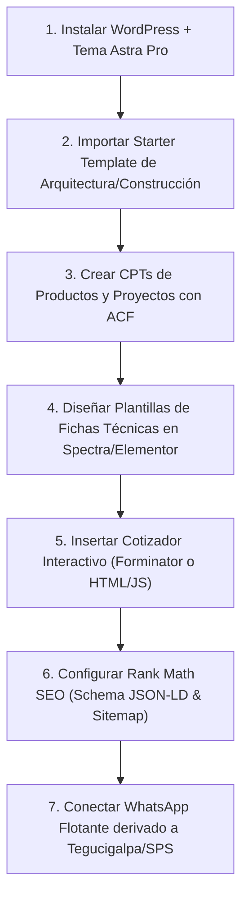

# 🚀 Arquitectura y Guía de Implementación en WordPress + Tema Astra

> **Proyecto:** Ventanales de Honduras (`ventanaleshn.com`)  
> **Tema Base:** **Astra Theme** (Astra Pro / Starter Templates)  
> **Propósito:** Guía técnica paso a paso para montar toda la estrategia, catálogo, proyectos y cotizador interactivo dentro del ecosistema WordPress utilizando Astra.

---

## 🛠️ 1. Stack de Plugins y Herramientas Recomendadas para Astra

Para replicar y superar la calidad visual de Canet y Estilos y Detalles sin perder velocidad (PageSpeed 90+), la combinación ideal con Astra es:

| Componente | Opción Recomendada | Razón / Función |
| :--- | :--- | :--- |
| **Tema Base** | **Astra** (Gratis o Astra Pro) | El tema más rápido y personalizable de WordPress. Excelente control de Header/Footer. |
| **Maquetador / Builder** | **Spectra** (Bloques nativos de Astra) O **Elementor Pro** | Spectra no sobrecarga la web (0 dependencias JS pesadas) y se integra 100% con Astra. |
| **Campos Personalizados (ACF)** | **Advanced Custom Fields (ACF)** | Para crear los campos técnicos de productos (Factor apertura %, Perfil PVC/Aluminio, Espesor vidrio). |
| **Proyectos & Catálogos (CPTs)** | **Custom Post Type UI** | Para crear la sección `/proyectos/` (Residencial, Comercial) y `/productos/`. |
| **Cotizador Interactivo** | **WPForms / Forminator Pro** O **Shortcode JS Personalizado** | Formulario con lógica condicional y cálculo automático de precios por $m^2$. |
| **SEO & Schema IA** | **Rank Math SEO Pro** | Para insertar las etiquetas OpenGraph, canonicals, `sitemap.xml` y Schema JSON-LD de LocalBusiness. |
| **Optimización & Caché** | **WP Rocket** + **LiteSpeed / StackCDN** | Compresión WebP automática de imágenes y caché de página. |
| **WhatsApp Flotante** | **Join.chat** O **Chaty** | Botón flotante inteligente con derivación a Tegucigalpa o San Pedro Sula. |

---

## 📐 2. Estructura de Páginas y Maquetación en Astra

### A. Encabezado (Header) y Mega Menú Astra Pro
* **Top Bar (Barra Superior):**
  * Teléfonos directos: `Tegucigalpa: +504 2213-8915` | `San Pedro Sula: +504 3192-2469`
  * Botón destacado: **"Solicitar Visita Técnica Gratis"** (Color de acento).
* **Menú Principal (Mega Menú Astra):**
  1. **Inicio**
  2. **Ventanería & Cristalería** (Desplegable: Ventanas PVC, Ventanas Aluminio, Fachadas Comerciales, Mamparas de Baño, Pasamanos).
  3. **Cortinas & Protection Solar** (Desplegable: Screen 1-5%, Blackout 100%, Neolux Dual Shade, Toldos de Exterior Zipro).
  4. **Proyectos** (Galería por sector: Residencial y Corporativo).
  5. **Para Arquitectos** (Sección B2B).
  6. **Cotizar Online** (Botón destacado tipo CTA).

---

## ⚙️ 3. Configuración de Productos y Fichas Técnicas con ACF (Custom Fields)

En WordPress, creamos un **Custom Post Type (CPT)** llamado `Productos` y `Proyectos`.  
Con el plugin **ACF (Advanced Custom Fields)** le asignamos los campos específicos que aprendimos de Canet y Estilos y Detalles:

### Campos ACF para Cortinas & Persianas:
* `factor_apertura` (Select: 1%, 3%, 5%, Blackout 100%)
* `proteccion_uv` (Texto: ej. "99% Filtración UV")
* `certificacion_fuego` (Checkbox: NFPA 701 Ignífugo)
* `tipo_motorizacion` (Select: Manual Cadenilla / Motor Smart Alexa-Somfy)
* `garantia_anos` (Número: ej. 3 años)

### Campos ACF para Ventanas y Fachadas:
* `material_perfil` (Select: PVC Termoacústico / Aluminio Anodizado)
* `tipo_vidrio` (Select: Templado 6mm, Laminado de Seguridad, Doble Vidrio DVH)
* `aislamiento_acustico` (Texto: ej. "Reducción de hasta 35dB")

---

## 🧮 4. Cómo Recrear el Cotizador Interactivo en WordPress + Astra

Hay dos formas muy sencillas de montar nuestro cotizador en Astra:

### Opción 1: Plugin Forminator (Gratuito y Muy Potente)
1. Instalar **Forminator** en WordPress.
2. Crear un formulario con los campos:
   * **Dropdown 1:** Tipo de Producto (Ventana PVC, Cortina Screen, Cortina Blackout, Mampara).
   * **Número 1:** Ancho (en metros).
   * **Número 2:** Alto (en metros).
   * **Campo de Cálculo (Calculated Field):** `Ancho * Alto * PrecioBaseMetroCuadrado`.
   * **Checkbox:** ¿Agregar Motorización Smart? (Suma +$120 USD si se marca).
3. Configurar el **Redireccionamiento a WhatsApp** en el envío del formulario usando la API de WhatsApp:
   `https://wa.me/50499999999?text=Hola,%20coticé%20en%20su%20web:%20{producto}%20de%20{ancho}x{alto}m.%20Total%20estimado:%20${calculo}`.
4. Insertar el shortcode `[forminator_form id="123"]` dentro de la página Astra creada con Spectra/Elementor.

### Opción 2: Insertar nuestro código HTML/JS actual (`cotizar.html`)
Si preferimos el diseño actual exacto:
1. En la página de WordPress creada en Astra, añadir un bloque de **HTML Personalizado** (Custom HTML).
2. Pegar el código de nuestro archivo `cotizar.html` y los scripts de cálculo de `assets/js/`.
3. Astra lo procesará de forma nativa sin ningún conflicto.

---

## 🖼️ 5. Galería de Proyectos con Hotspots (Inspirado en Canet)

Para lograr el efecto de imágenes de salas/edificios con puntos interactivos que aprendimos de Canet:
1. Instalar el plugin gratuito **Draw Attention** O **Image Map Pro for WordPress**.
2. Subir la fotografía en alta resolución del proyecto completado en Honduras.
3. Marcar los puntos calientes (hotspots):
   * **Punto 1 (Ventana):** *"Ventana Corrediza PVC Blanco Termoacústico"*.
   * **Punto 2 (Cortina):** *"Cortina Roller Screen 3% Motorizada Somfy"*.
4. Insertar la imagen interactiva en la plantilla de Astra.

---

## 🚀 6. Pasos Concretos para Ejecutar la Migración a WordPress + Astra

### Paso 1: Instalación de Astra & Starter Templates
* En `Apariencia > Temas > Añadir nuevo`, buscar **Astra**.
* Activar el plugin **Starter Templates** y seleccionar una plantilla previa del nicho *Architecture*, *Interior Design* o *Home Improvement*.

### Paso 2: Copiar nuestros Bloques de la Guía de Implementación
* Usar los bloques HTML/CSS de `NOTAS_IMPLEMENTACION_INMEDIATA.md`:
  * El **Banner de Visita Técnica Gratis**.
  * El **Proceso en 5 Pasos**.
  * Los **Factores de Apertura de Cortinas**.

### Paso 3: Configurar Rank Math SEO
* Pegar el código JSON-LD de `LocalBusiness` que generamos en la sección de Schema de Rank Math para garantizar presencia en Tegucigalpa y San Pedro Sula.
